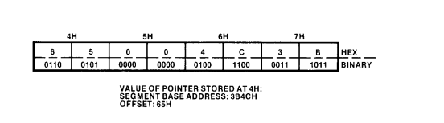

Two words next to each other or one 32-bit word with mixed endianness?

Bottom 2 bits of opcode (when not using the prefix byte) tend to correspond to whether it is a memory or register operand, and 8 or 16 bit operands
But not always
We should just make different enum types for each different variant even if they are the same instruction (ADD, OR, etc.)

Store arith flag along with opcode in the table
If arith flag is set then the opcode is really just the top 6 bits 
And we can extract the d, s flags in the bottom 2 bits

if (flag) {
    
    int op1 = d ? read_reg() : read_mod_rm();
    int op2 = d ? read_mod_rm() : read_reg();

    switch (op >> 2) {
        case ADD:
            // function handles flags
            X86_ADD(state, op1, op2)
        case AND:
            etc. 
    }

    if (d) {
        write_reg()
    } else {
        write_mod_rm();
    }

}
